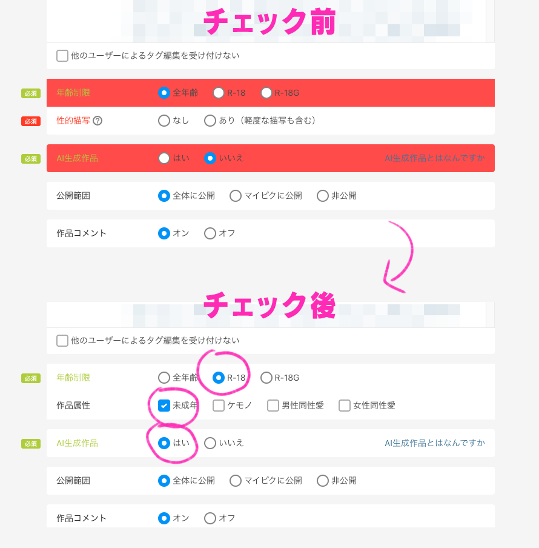

# pixiv Auto Categorizer

pixiv 投稿画面で「R-18」のチェック忘れを防止するためのツールです。

- R-18 を自動でチェックする
  - チェックがないと警告色になる
- 「作品属性」のいずれかにチェックがないと警告色になる
- AI生成を自動でチェックする
  - チェックがないと警告色になる

自分用に作ったのでカスタマイズ機能はありません。

## Install

1. [Tags](https://github.com/da2el-ai/pixiv-auto-categorizer/tags) から最新版をZIPでダウンロード
2. ZIPを解凍する
3. Chromeの機能拡張管理画面を開く
   - [chrome://extensions/](chrome://extensions/)
4. 画面右上の `デベロッパーモード` を有効にする
5. 解凍したフォルダごとChromeにドラッグ・ドロップする
6. pixivの[投稿画面](https://www.pixiv.net/illustration/create)を開く

**※解凍したフォルダは削除や移動をしないでください。フォルダがなくなると機能拡張がアンインストールされます。**